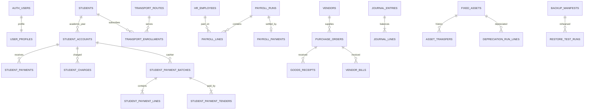

# Bradford School ERP — current baseline ERD

This is the Phase 0 domain map. It documents the current database; it does not imply that every workflow is complete.

## Trust boundaries

1. GitHub Pages is an untrusted public client. It may hold a publishable Supabase key, never privileged credentials.
2. Supabase Auth establishes identity and MFA assurance.
3. RLS and guarded PostgreSQL RPCs enforce roles, row scope and workflow transitions.
4. Private Storage must enforce path ownership/role rules and issue short-lived signed URLs.
5. Future ETA, GPS, email and messaging providers must be called only from authenticated server-side adapters using managed secrets.
6. Backups leave Production only as encrypted artifacts with a SHA-256 manifest and are restored only into an isolated target.
